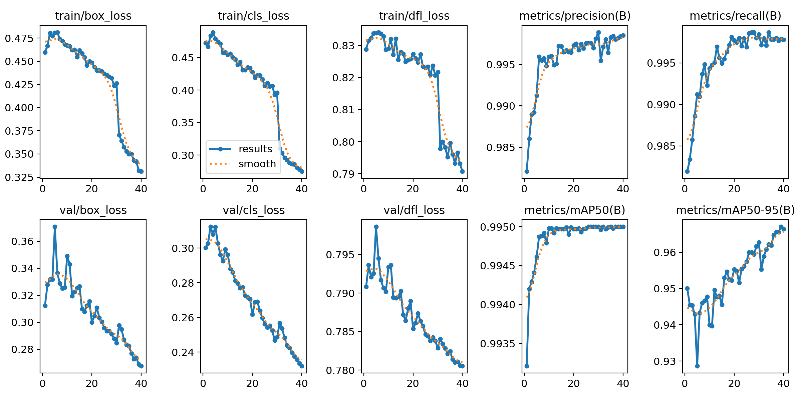

# captcha-solver
Solve Image based captchas for OwObot

[OwObot](https://owobot.com) is a Discord Bot, which provides a competitive text based game. This project aims at solving text based Image captchas in order to automate this text based game.
We do this with the help of YOLO and Labelme.

---
**Files / folders:**
`train.py`
>  To actually train the model. No pre-processing of images was done (was lazy). Perhaps you should consider preprocessing, as that may fetch better results.

`test_onnx.py`
> After exporting to an ONNX model, we can test the captcha solver with this file. 

`convert_yolo.py`
> This converts the JSON format from Labelme to a format required for training YOLO model with the help of ultralitics

`auto_annotate.py`
> This is an helper which utilises previously trained model to help annotate images (JSON format for Labelme). This is then validated manually before proceeding with training

`duplicate_finder.py`
> Helps find potential duplicate images in from the available dataset

`move_reqs.py`
> Helps move required images, prioritising those with letters required in them.

`test.py`
> This helps test the YOLO model after training. 
> Also sorts out failed images to a folder which can then be used to take appropriate measures to increase accuracy by further training.

`examples` 
> folder contains 5 example captchas from OwO-Bot

`images`
> This folder contains result of the last training.

---
Almost all captcha images in use in my dataset was fetched with the help of https://github.com/Tyrrrz/DiscordChatExporter
https://github.com/wkentaro/labelme was used to annotate captcha images.
There may be better alternatives to Labelme available (Like Roboflow for example), I choose Labelme to keep everything local.

**Results:** 
 
<small>more available through `images` folder.</small>

**Conclusion:**
I managed to reach around 97%~ accuracy with a dataset of 1126 images. This accuracy perhaps coule be enchanced with the help of proper pre-processing. I had not used any form of pre-processing for this project.

Feel free to use this mode **in compliance with GNU GPL V3** licence :>
Overall this was a fun project, I could learn alot from it!
